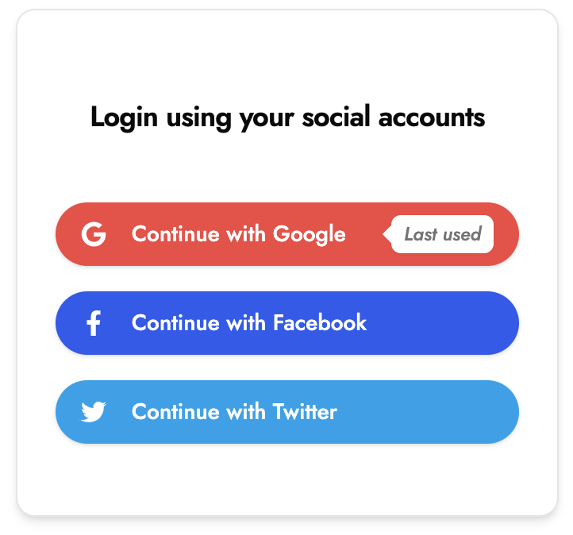

# 🪄 Remember Last Login

Automatically shows the last used social login method for quicker re-entry.

---

## 💡 What it is

- Displays the login method you used last time (e.g. Google, Apple)
- Reduces friction for returning users by skipping redundant decisions

## 🧠 How it works

```ts
// Save selected login method in localStorage
localStorage.setItem("lastLoginProvider", "google");
```

- Uses `localStorage` to remember and highlight the last provider
- React state hooks + conditional rendering with Tailwind animations

---

## ⚙️ Tech Stack

- React (Next.js)
- Shadcn UI
- Tailwind CSS
- Typescript

---

## 🖼️ Screenshot

  

---

## 🔗 Demo

[lilygo.vercel.app/lab#01-remember-last-login](https://lilygo.vercel.app/lab#01-remember-last-login)

## 💻 Source

[components/lab/01-remember-last-login](https://github.com/devlilygo/devlilygo.github.io/tree/main/src/components/lab/01-remember-last-login)
