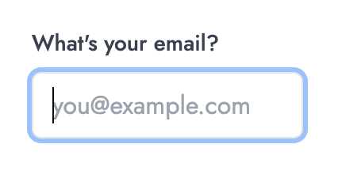

# 🪄 Remember Last Login

Auto-focuses the input only after the user starts typing, preventing unwanted scroll jumps and improving flow on mobile.

---

## 💡 What it is

- Waits for the user to press any key before focusing the input
- Avoids sudden scroll jumps on page load, especially on mobile
- Keeps the interface clean while still minimizing user friction

## 🧠 How it works

```ts
// Focus input when key down
useEffect(() => {
  const handleKeyDown = () => {
    inputRef.current?.focus();
    document.removeEventListener("keydown", handleKeyDown);
  };

  document.addEventListener("keydown", handleKeyDown);

  return () => {
    document.removeEventListener("keydown", handleKeyDown);
  };
}, []);
```

- Uses `useRef` to target the input
- Listens for the first `keydown` event
- Calls `.focus()` only once when the user interacts
- Prevents auto-scroll issues on page mount

---

## ⚙️ Tech Stack

- React (Next.js)
- Shadcn UI
- Tailwind CSS
- TypeScript

---

## 🖼️ Screenshot



---

## 🔗 Demo

[lilygo.vercel.app/lab#02-input-autofocus](https://lilygo.vercel.app/lab#02-input-autofocus)

---

## 💻 Source

[components/lab/02-input-autofocus](https://github.com/devlilygo/devlilygo.github.io/tree/main/src/components/lab/02-input-autofocus)
