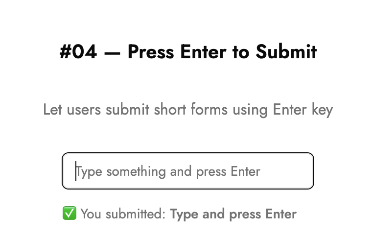

# ⌨️ Press Enter to Submit

Let users submit short forms—like search bars or chat inputs—just by pressing **Enter**.

---

## 💡 What it is

- Automatically triggers submit when the user presses `Enter`
- Saves users from having to click a button
- Useful for search, chat, or quick login inputs

## 🧠 How it works

```tsx
const handleKeyDown = (e: React.KeyboardEvent<HTMLInputElement>) => {
  if (e.key === "Enter") {
    handleSubmit();
  }
};
```

- Attach `onKeyDown` to the input
- Detect if `e.key === "Enter"`
- Call your submit function directly

> 📝 Bonus Tip:  
> For multiline inputs (like textarea), prevent submission unless `Shift + Enter` is used.

---

## ⚙️ Tech Stack

- React (Next.js)
- Tailwind CSS
- TypeScript

---

## 🖼️ Screenshot



---

## 🔗 Demo

[lilygo.vercel.app/lab#04-press-enter-submit](https://lilygo.vercel.app/lab#04-press-enter-submit)

---

## 💻 Source

[components/lab/04-press-enter-submit](https://github.com/devlilygo/devlilygo.github.io/tree/main/src/components/lab/04-press-enter-submit)
