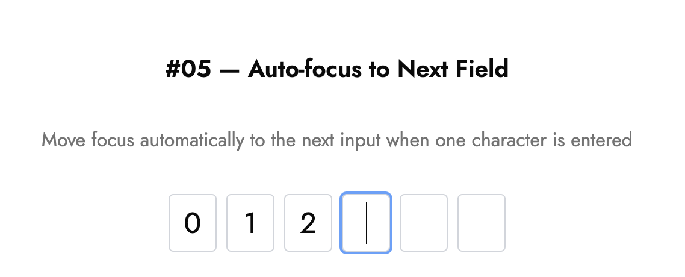

# ⌨️ Press Enter to Submit

Move the focus to the next input automatically as soon as the user enters a character.

---

## 💡 What it is

- Removes unnecessary taps or clicks
- Creates a smooth experience for entering OTP, phone numbers, or birthdays
- Simple logic (`ref` + `onChange`), but feels super polished

## 🧠 How it works

```tsx
const handleChange = (e, idx) => {
  if (e.target.value.length === 1) {
    refs.current[idx + 1]?.focus();
  }
};
```

- Each input only accepts **one character**.
- When the user types, it automatically focuses the **next input field**.
- Backspace returns focus to the **previous field**.

---

## ⚙️ Tech Stack

- React (Next.js)
- Tailwind CSS
- TypeScript

---

## 🖼️ Screenshot



---

## 🔗 Demo

[lilygo.vercel.app/lab#05-auto-focus-to-next-field](https://lilygo.vercel.app/lab#05-auto-focus-to-next-field)

---

## 💻 Source

[components/lab/05-auto-focus-to-next-field](https://github.com/devlilygo/devlilygo.github.io/tree/main/src/components/lab/05-auto-focus-to-next-field)
