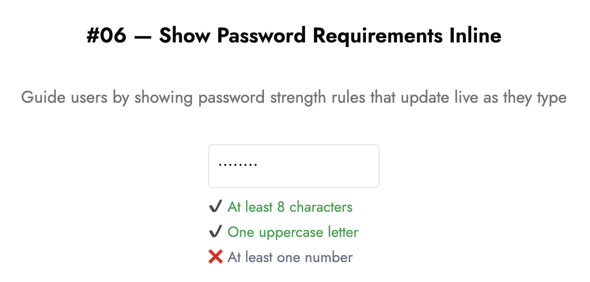

# 🔒 Show Password Requirements Inline

Guide users by showing password strength rules that update live as they type.

---

## 💡 What it is

- Helps users succeed on the **first try**
- Reduces frustration from hidden password rules
- Turns password creation into a guided, interactive experience
- Tiny detail that makes a huge difference in signup flows

---

## 🧠 How it works

```tsx
const rules = [
  { id: "length", label: "At least 8 characters", test: (val) => val.length >= 8 },
  { id: "upper", label: "One uppercase letter", test: (val) => /[A-Z]/.test(val) },
  { id: "number", label: "At least one number", test: (val) => /[0-9]/.test(val) },
];

<input
  type="password"
  value={password}
  onChange={(e) => setPassword(e.target.value)}
  placeholder="Create password"
/>

<ul>
  {rules.map(rule => {
    const ok = rule.test(password);
    return (
      <li key={rule.id}>
        {ok ? "✔️" : "❌"} {rule.label}
      </li>
    );
  })}
</ul>

```

- Each input only accepts **one character**.
- When the user types, it automatically focuses the **next input field**.
- Backspace returns focus to the **previous field**.
- Define rules as an **array of tests**.
- As the user types, each rule updates **live**.
- Success/failure is shown with **visual feedback** (✔️ / ❌, colors).

---

## ⚙️ Tech Stack

- React (Next.js)
- Tailwind CSS
- TypeScript

---

## 🖼️ Screenshot



---

## 🔗 Demo

[lilygo.vercel.app/lab#06-password-requirement-input](https://lilygo.vercel.app/lab#06-password-requirement-input)

---

## 💻 Source

[components/lab/06-password-requirement-input](https://github.com/devlilygo/devlilygo.github.io/tree/main/src/components/lab/06-password-requirement-input)
