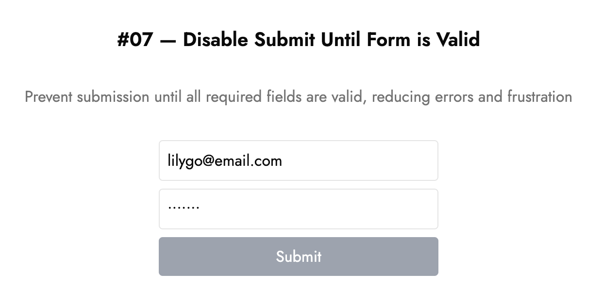

# 🚫 Disable Submit Until Form is Valid

Prevent users from submitting a form until all required fields are valid.

---

## 💡 What it is

- Stops users from hitting **Submit** too early
- Reduces error messages and failed attempts
- Guides users to complete the form correctly before sending

---

## 🧠 How it works

```tsx
const isValidEmail = /\S+@\S+\.\S+/.test(email);
const isValidPassword = password.length >= 8;
const isFormValid = isValidEmail && isValidPassword;

<form onSubmit={handleSubmit}>
  <Input type="email" ... />
  <Input type="password" ... />
  <Button type="submit" disabled={!isFormValid}>Submit</Button>
</form>

```

- Button is **disabled** until the form is valid
- Once valid, it becomes clickable
- On submit, show a small toast/snackbar ✅

---

## ⚙️ Tech Stack

- React (Next.js)
- Tailwind CSS
- TypeScript
- shadcn/ui

---

## 🖼️ Screenshot



---

## 🔗 Demo

[lilygo.vercel.app/lab#07-disable-submit-until-valid](https://lilygo.vercel.app/lab#07-disable-submit-until-valid)

---

## 💻 Source

[components/lab/07-disable-submit-until-valid](https://github.com/devlilygo/devlilygo.github.io/tree/main/src/components/lab/07-disable-submit-until-valid)
